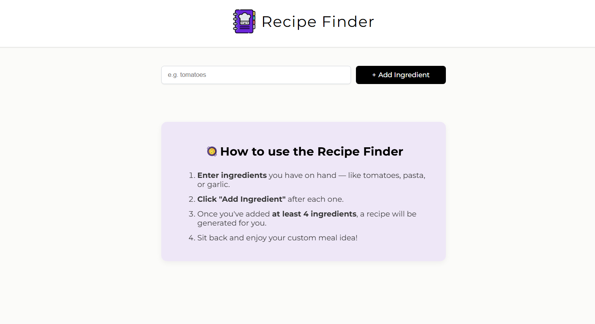
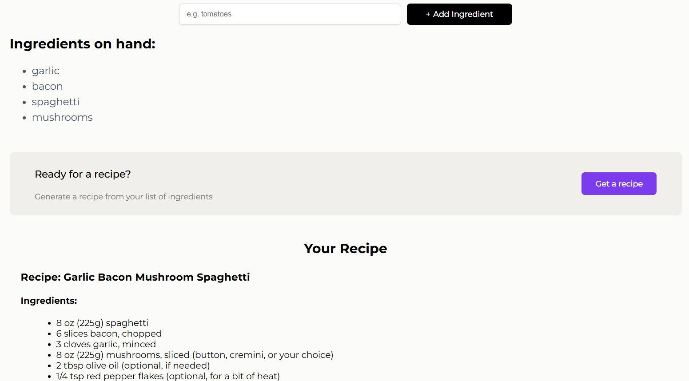

# 🥘 Recipe finder

A responsive web app that helps users discover meal ideas based on ingredients they already have at home. Powered by AI, it generates a personalized recipe suggestion busing the selected ingredients.

## 🚀 Live Demo

[Try the app](https://recipe-finder-random.netlify.app/)

## ⚡ Features

- Add ingredients one by one
- Prevents duplicates or empty entries
- Displays a recipe after 4+ ingredients are entered
- Loading indicator while fetching recipe
- AI-generated output rendered with Markdown
- Responsive layout and mobile-friendly design
- Friendly onboarding tips and toast notifications

## 🛠️ Tech Stack

- **React**: Frontend UI and component logic
- **Netlify Functions** - Serverless backend for API handling
- **OpenRouter API + DeepSeek model** - AI-powered recipe generation
- **React Hot Toast** - Clean and accessible notifications
- **React Markdown** - To format the recipe content
- **React Spinners** - Smooth loading animation
- **CSS Media Queries** - For responsive styling

## 📸 Screenshots

**Start Screen** 

**Recipe Suggestion View**

## 💡 Why I Built This

I wanted to explore AI integration in front-end development and solve a real-life problem: deciding what to cook with limited ingredients. This project helped me practice working with serverless functions, external API and state management in React. 

---

Thanks for checking it out! 😊